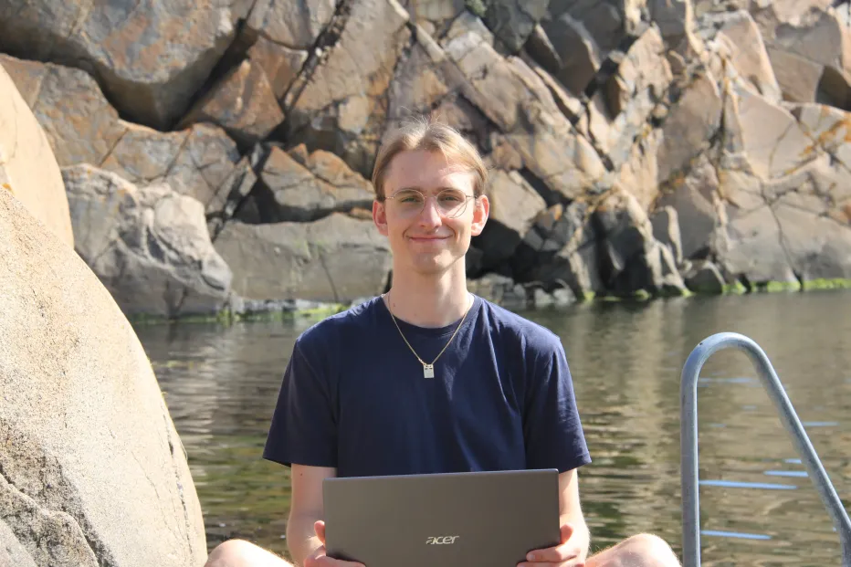

+++
title = 'About'
date = 2024-01-14T11:40:24+01:00
draft = false
+++

Greetings! My name is Ivar. I'm a Swedish game developer from Tjörn, the heart of the Bohuslän archipelago!

As of now I'm a bit in the middle of an identity crisis. I have studied both the Technical Artist and 
Game Programmer educations at The Game Assembly and I'm unsure what I should refer myself, but one 
sure thing is that I'm very interested and specialize in computer graphics and pipeline automation. As a
game programmer I obsessed over the engine architecture, the graphics infrastructure and over time shaped 
my own ecosystem of tools for content creation and shredding graphics cards. 

However, I really missed the collaborative aspects of game development and rarely interacted with other disciplines
when I worked on the engine side of things. I pursued the Technical Artist education with the goals of gaining a 
broader technical skillset with 3D software, collaborating with other disciplines to resolve pipeline bottlenecks
and let my creativity flow with zesty special effects. So far it has been a process I have thorougly enjoyed!

## Contacting Me
My preferred method of communication is by email. However, do not be afraid of calling me if it's urgent!

