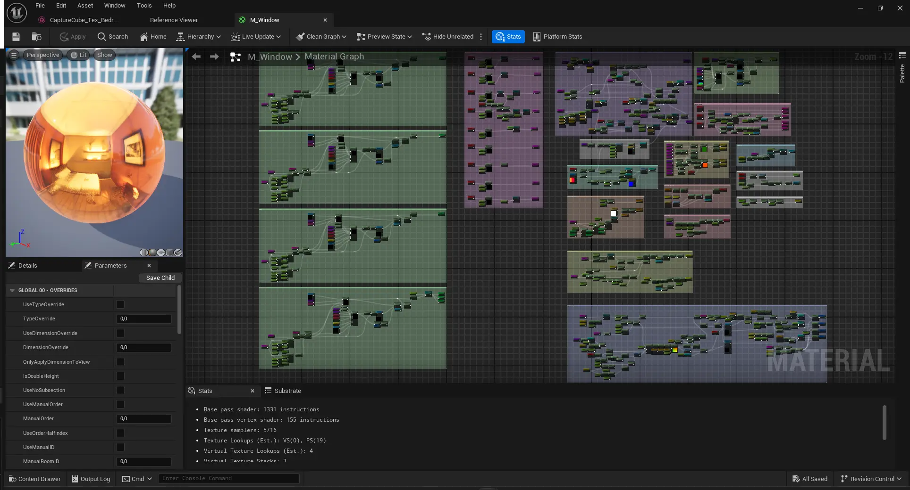

+++
title = 'Homemade Interior Mapping'
summary = '''
'''
tags = []
date = 2025-02-10
draft = false
+++
I created the interior mapping shader and interior cubemaps used for this demo. Big thanks to [Agnes Hallin](https://agneshallin.artstation.com/projects) for letting me use her modular building kit and the environment used in the background!




I have a big fascination for parallax effects in games and wanted get a better understanding of how these techniques work. I found the [Interior Mapping paper by Joost van Dongen (2008)](https://www.proun-game.com/Oogst3D/CODING/InteriorMapping/InteriorMapping.pdf) during my research and wanted to give an attempt at implementing this myself. 

The technique uses raycasting to determine where in the cubemap to sample from. By raycasting against a corresponding plane for X, Y, Z and selecting the closest point of intersection, we can sample the cubemap in such a way to give the illusion of volume inside a flat plane!




## How object-space interior mapping works
### Understanding intersections between rays and planes
```hlsl
float PlaneRayIntersection(float3 RayPoint, float3 RayDirection, float3 PlaneNormal, float PlaneDistance)
{
    float T = PlaneDistance - dot(RayPoint, PlaneNormal);
    T /= dot(RayDirection, PlaneNormal);
    return T;
}
```
I use this code snippet to calculate intersections between rays and planes. To use it properly it's important to understand what rays and planes from a purely mathematical standpoint. I wholeheartedly recommend [gamemath.com](https://gamemath.com/book/geomtests.html#intersection_ray_plane) for a proper explanation, but here is at least a freshly baked visualization!

In my opinion, the key takeaways are that rays are parametrically defined by a point and a direction and planes are implicitly defined by a normal and a distance from the origin. Unlike 3D geometry, rays and planes in mathematics are infinite. Unless the ray is perfectly perpendicular to a plane, it will always intersect in either the positive or negative direction.

### Calculating the planes to intersect against


We begin by calculating the planes to raycast against. For this we need to calculate each planes normal and distance to the origin. The distance can be calculated by rounding the local vertex position to the size of the room, but depending on the direction we also need to take into consideration which side of the room the plane exists and wether the distance needs to be negated if the plane is facing the origin.

**Positive X plane** 
```hlsl
(ceil(ObjectPosition.x / RoomSize.x) - 1) * RoomSize.x
```
**Negative X plane**
```hlsl
ceil(ObjectPosition.x / RoomSize.x) * -RoomSize.x
```

Wether the normals of the XYZ planes faces the positive or negative direction can be calculated by the sign of the inverted camera direction. This way we thankfully won't have to check against 6 planes, only 3.
```hlsl
float3 PlaneNormals = -CameraDirection;
PlaneNormals.x = sign(PlaneNormals.x);
PlaneNormals.y = sign(PlaneNormals.y);
PlaneNormals.z = sign(PlaneNormals.z);
```
### Calculating the cubemap sampling direction
```hlsl
float T, ClosestT = 100000;
T = Fn.PlaneRayIntersection(CameraPosition, CameraDirection, float3(PlaneNormals.x, 0, 0), PlaneDistances.x);
if (T > 0 && T < ClosestT)
{
	ClosestT = T;
}
T = Fn.PlaneRayIntersection(CameraPosition, CameraDirection, float3(0, PlaneNormals.y, 0), PlaneDistances.y);
if (T > 0 && T < ClosestT)
{
	ClosestT = T;
}
T = Fn.PlaneRayIntersection(CameraPosition, CameraDirection, float3(0, 0, PlaneNormals.z), PlaneDistances.z);
if (T > 0 && T < ClosestT)
{
	ClosestT = T;
}

float3 Intersection = CameraPosition + CameraDirection * ClosestT;
```
When all the planes have been calculated, we can raycast against them to find where the point of intersection would be for each fragment. By storing the closest intersection distance the closest point of intersection can be calculated by using the ray origin and ray direction.



When the closest point of intersection is known, we are actually quite close to calculating the cubemap sampling direction! We only additionally need the center of the room, which can be calculated by rounding the vertex position again and truncating the result with half a room. We can subsequently calculate the direction from the center of the room to the intersection point by subtracting and normalizing the result.
```hlsl
float3 RoomCenter = (ceil(ObjectPosition * Bias / RoomSize) - 0.5f) * RoomSize;
float3 Direction = normalize(Intersection - RoomCenter);
```

As a result we should now have interior mapping that tiles infinitely with an adjustible room size!



## If I had more time
If I had more time I would definetly be interested in adding furniture inside of the rooms as well. My main inspiration for this project was the [Matrix Awakens](https://www.unrealengine.com/en-US/blog/introducing-the-matrix-awakens-an-unreal-engine-5-experience) demo for Unreal Engine 5 and I think it uses dual-depth relief mapping to create furniture. It has uncannily convincing volume most of the time!



I wanted to figure out how it works, but the material graph doesn't even fit on the screen entirely. As of now assembling spaghetti at this scale is absolutely beyond me but maybe there is a method to this madness. If you know, I'd very much like to hear from you :-)

