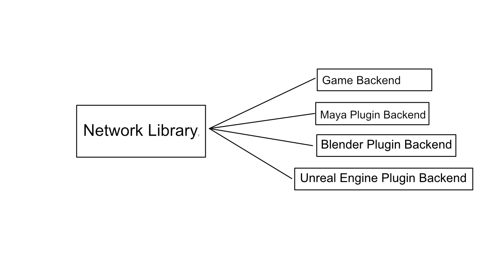

+++
title = 'Live Maya Exporter'
summary = '''
'''
tags = []
date = 2025-01-03
draft = false
+++
I created a Maya plugin that lets the user seamlessly update models while the game is running simultaneuosly. I'm very grateful to [Alvin Andersson Eriksson](www.alvineriksson.com) for letting me modify the game engines asset manager to fit my peculiar needs!



TODO: ändra

Have you ever been frustrated about exporting a model from Maya or Blender just to find out that it looks different ingame? Wouldn't it be terribly convenient if you could just see the model update directly ingame without fuss?

I've made a plugin for Maya that let's you do precisely that at the press of a button! 



## How it works
At the heart lies a networking library I've written. It allows applications to communicate between each other over the local area network by sending and recieving commands through different backends.



When the game has launched, it automatically connects to any running instance of Maya. When Maya has acknowledged the connection, it's allowed to send commands to the running instance of the game. In this case, lets break down how the live export works!
### How live export from Maya works
When the Maya plugin is enabled and has initialized itself, the C++ command for live exporting can be executed in the MEL console window or be bound to a hotkey. The command exports the Maya scene to FBX in a temporary directory and subsequently requests the game to reload the model. 

We need to send both the model name and the path to the temporary FBX for this to work. However, we can only send one string argument. This means we need to fit two strings in one, and to accomplish this we separate the values with a delimiter. I choose to separate with `=`, as in `key=value`.
```cpp
MStatus exportCommand::doIt(const MArgList& args) 
{
    //could handle backup saves automatically, but probably won't for now
    std::filesystem::path currentFile = MFileIO::currentFile().asWChar();
    currentFile = currentFile.filename();
    currentFile.replace_extension();

    std::filesystem::path exportFile = std::filesystem::temp_directory_path() / L"libtacom" / currentFile;
    exportFile = exportFile.generic_wstring();
    MString exportFileStr = exportFile.c_str();
    exportFile.replace_extension(".fbx");

    if (std::filesystem::exists(exportFile))
    {
        std::filesystem::remove(exportFile);
    }
    else
    {
        std::filesystem::create_directories(exportFile.parent_path());
    }

    MStatus status;
    status = MFileIO::exportAll(exportFileStr, "FBX export");
    if (status != MStatus::kSuccess)
    {
        MGlobal::displayError(status.errorString());
        return MS::kFailure;
    }


    std::ostringstream arg;
    arg << currentFile;
    arg << '=';
    arg << exportFile;
    libtacom::broadcast_net_message(libtacom::net_message::create(libtacom::net_message::reload_asset, arg.str().c_str()));
    libtacom::flush();
    return MS::kSuccess;
}
```

### How the game responds
When the game initializes the networking library, it has to decide how to respond to commands sent from Maya and any other backends. It does so by providing a set of callback functions for each message type.
```cpp
using libtacom::net_message;

libtacom::config config;
config.type = libtacom::config::type::client;
config.log_info_callback = &libtacom_LogInfoCallback;
config.log_warning_callback = &libtacom_LogWarningCallback;
config.log_error_callback = &libtacom_LogErrorCallback;
config.message_callbacks[net_message::find_asset] = &libtacom_FindAssetCallback;
config.message_callbacks[net_message::open_asset] = &libtacom_OpenAssetCallback;
config.message_callbacks[net_message::reload_asset] = &libtacom_ReloadAssetCallback;
libtacom::initialize(config);
```
Since we could only send a single string along with the command sent from Maya, we need to separate the arguments with the `key=value` delimiter we choose previously. When we have split the argument into a model name and temporary FBX path again, we can request the asset manager to reload the model.
```cpp
static void libtacom_ReloadAssetCallback(const libtacom::address&, const libtacom::net_message& message)
{
	const std::string_view str = message.to_string_view();

	std::size_t delim = str.find('=');
	if (delim == std::string_view::npos)
	{
		LOG(LogLibtacom, Error, "reload message does not contain delimiter '='");
		return;
	}


	//does not handle quotes in middle of string or trailing whitespace
	std::string_view key = str.substr(0, delim);
	if (!key.empty() && key.front() == '"')
	{
		key.remove_prefix(1);
	}
	if (!key.empty() && key.back() == '"')
	{
		key.remove_suffix(1);
	}


	std::string_view value = str.substr(delim + 1, std::string_view::npos);
	if (!value.empty() && value.front() == '"')
	{
		value.remove_prefix(1);
	}
	if (!value.empty() && value.back() == '"')
	{
		value.remove_suffix(1);
	}

	LOG(LogLibtacom, Log, std::format("reload_asset '{}' ({})", key, value).c_str());
	TRK::AssetImporter::GetInstance().ReloadMeshByName(std::string(key), value);
}
```

And that is everything! 

## Challenges of the project
### CMake and creating Python bindings
### The Maya DevKit SDK
### Testing the networking

## If I had more time
If I had more time the first thing I would do is to create a general Python backend so that it could be implemented in Blender, Substance Designer, Unreal Engine and almost any application really with a modern builtin Python interpreter and plugin architecture.

I've also considered changing the client-server architecture so that multiple games and editors can coexist with a single server application running in the background.