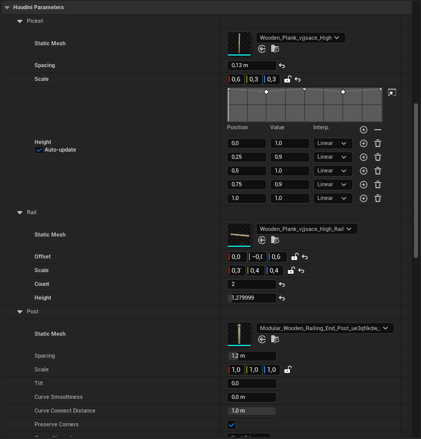

+++
title = 'Procedural Fence Generator'
weight = 1
summary = '''
'''
tags = []
date = 2025-03-10
draft = false
+++
# Procedural Fence Generator
I've created a spline-driven fence generator in Houdini with tweakable parameters that lets the user create fences from already existing models! All the models used below are from [Quixel Megascans](https://www.fab.com/sellers/Quixel).



For a long time I was intimidated about learning Houdini for game development, but I was inspired by a lecture from [David Lindberg](https://www.artstation.com/davidlindberg8) to start small in Houdini and develop increasingly sophisticated things over time. During [Spite Parasite](/projects/spite-parasite) I decided to integrate Houdini into our custom engines pipeline, and with all the accumulated experience from producing smaller Houdini Digital Assets during development I've become a lot more confident with Houdini.

With this fence generator I wanted to dive deeper into producing Houdini Digital Assets natively for Unreal Engine with many parameters that users can bend to their will. During testing I discovered many happy accidents that were polished into features in the end!

## Placing fences in the level


When the user drags the Houdini Digital Asset into the level, they are immediately presented with a spline that they can adjust and add control points to. Adjusting control points or parameters automatically causes Houdini Engine to recook the asset.

This particular fence generates points used for instancing, and instances different models whether the point represents a board, post or rail. Using instancing this way makes the fences very modular and lets users create variations based on individual pieces of the fence rather than a complete fence.

## Generating the fence


The process of generating the fence basically comes down to
1. Place post points along the input curve.
2. Place board points and orient them by interpolating between adjacent posts.
3. Merge board points at special segments into gates instead.
3. Place rail points based on the median position of the boards, taking their up direction into consideration.
4. Instantiate static meshes at each point by setting the `s@unreal_instance` attribute, or optionally debug geometry.

## Challenges
I think one of the more challenging aspects of creating the surface operator was how to handle all the dependencies between boards, posts and rails. I initially tried to separate and avoid all dependencies between the logic for generating points to boards, posts and rails, but this was significantly more fragile than I had expected. Over time I settled on a very monolithic graph with explicit steps where I cleaned up attributes as soon as they were redundant. This way I didn't have to keep track of their lifetime in my head and be afraid to lose them in very aggresive cleanup steps further down the line.

I also initially relied on VEX too much. I think I've become better at judging when VEX is needed and how to split up wrangles to take a more modular approach. I've come to appreciate the node-based workflow and how it lets the user build and experiment with different control flows side by side in a way that isn't possible with plain-text and multiline comments. I wonder what a hybrid language of node and plain-text would look like!