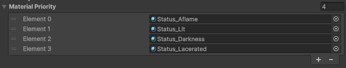

+++
title = 'Stacking Status Effects'
weight = 1
summary = '''
'''
tags = []
date = 2025-11-04
draft = false
+++

# Stacking Status Effects
This is my first portfolio from [Birdisland](https://www.birdisland.studio/)! It's from a soon-to-release demo featuring turn-based combat similar to divinity original sin, and a crucial aspect to communicate through VFX are the status effects!


## Invidual effects
Currently the player can be aflame, lacerated, or affected by darkness which encloses the area for each turn the player is surrounded by enemies.

### Aflame
Shader consists of double layers of scrolling noise. They are sampled using triplanar projection to move vertically but only on the Y axis, since we want the noise to feel like it's sticking to the character even if it moves or swings its arms.

The particles consists of double layers of scrolling noise and sampling the characters skinned mesh for positioning the particle.

### Lacerated
Shader is a translucent blood texture.

The particles are positioned by sampling the characters skinned mesh. When they fall to the ground they are killed and emit a GPU particle for the blood splash. The blood splash dissolves quickly but becomes larger by the end of its life for splashiness.

### Darkened
Shader is similar to the fire effect with triplanar projection, though has a fresnel that only shows the effect by the edges. This is to make the characters more recognizible and improve readability of stacked effects.

Currently has no particles.

## How it works
A single status effect works by simulating particles and rendering an additional translucent pass on top of the character. The player can be both aflame, lacerated, and darkened if he/she is very unlucky! 

Rendering multiple status effects are supported by setting different priorities for the effect types that determines the draw order. This way the blood is drawn clinging closely to the body while fire is drawn on top.


