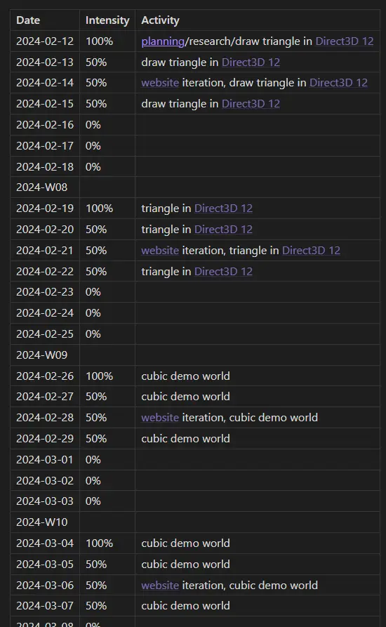
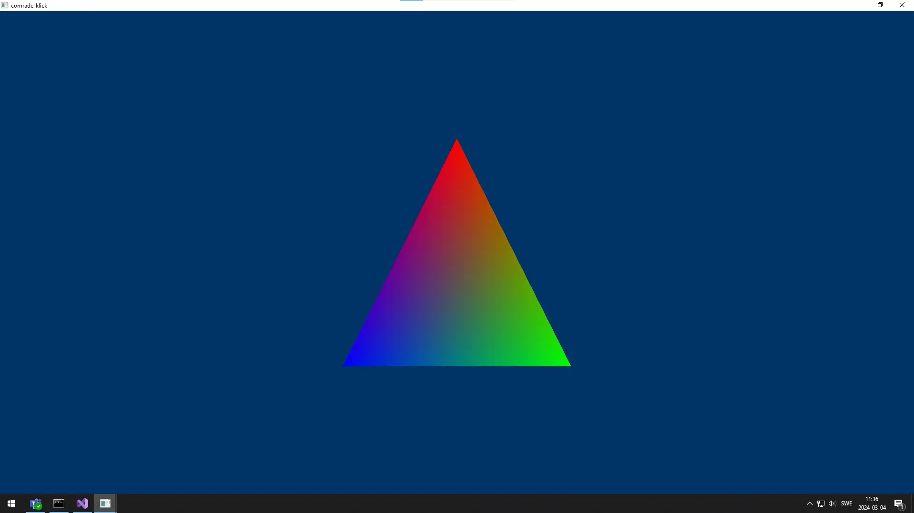
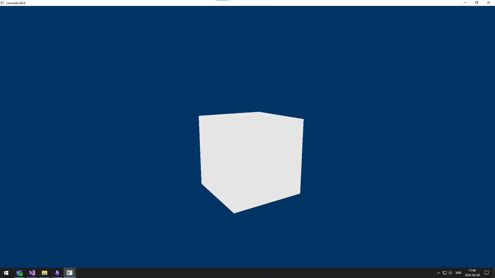
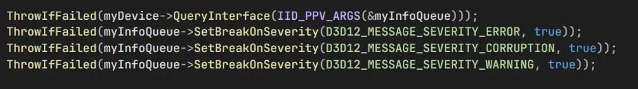
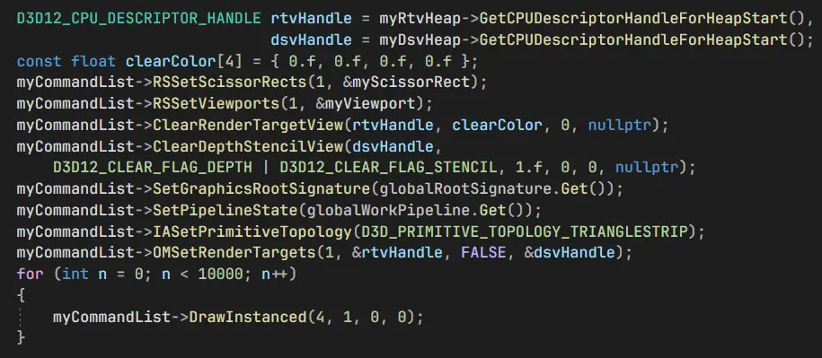
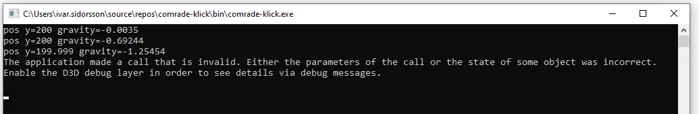
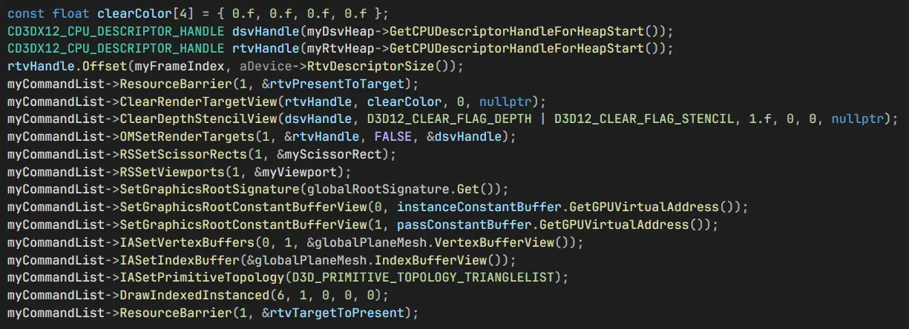
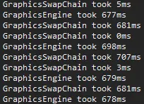

+++
title = 'comrade-klick'
summary = '''
[_comrade-klick_](https://github.com/fluffy-kalashnikov/comrade-klick) was my specialization 
project at [The Game Assembly](https://thegameassembly.com). I attempted to create a basic 
implementation of asynchronous reprojection in Direct3D 12 but did not finish in time.
'''
tags = ['C++', 'Direct3D 12', 'Git', 'RenderDoc', 'PIX']
date = 2024-01-07T18:58:06+01:00
draft = false
screenshot = '/projects/comrade-klick/thank-you-pix.webp'
credits = [
    'Ivar Sidorsson'
]
+++

[_comrade-klick_](https://github.com/fluffy-kalashnikov/comrade-klick) was my specialization 
project at [The Game Assembly](https://thegameassembly.com). I attempted to create a basic 
implementation of asynchronous reprojection in Direct3D 12 but did not finish in time.



## Introduction
I've been an avid subscriber of [3kliksphilip](https://www.youtube.com/@3kliksphilip)/[2kliksphilip](https://www.youtube.com/@2kliksphilip)/[kliksphilip](https://www.youtube.com/@kliksphilip) for a long time. During my first term at The Game Assembly 
he released [_DLSS 3 - What I think of it_](https://www.youtube.com/watch?v=OjPEdtd1g6I&t=539s). 
Shortly after he released [_The future of upscaling?_](https://youtu.be/f8piCZz0p-Y?si=iPn88J_FmiLd_DZK)
showcasing a demo made by [Comrade Stinger](https://www.youtube.com/@comradestinger) and a 
video titled [_Async Reprojection outside of VR_](https://www.youtube.com/watch?v=VvFyOFacljg).
I took very great interest in the video and it has since stuck in my mind. It is a very
mind-bending technique as there appears to be 2 separate layers of rendering happening 
concurrently, and when I were to choose a specialization project it felt like a good
opportunity to deep-dive into the topic in a way I've never had the time to do before.



Asynchronous reprojection is an essential fallback in Virtual Reality to accomodate sudden
frame drops which unattended results in severe motion sickness. I have not found any resources
online describing the necessary steps for implementing asynchronous reprojection and I am 
unsure if the desktop-specific variant even has a name, so Comrade Stinger's video above 
has been my main point of reference.

My basic theory of how the effect works without stretching/blurring is the following.
* The game exists in 2 separate dimensions, the main dimension and the swapchain dimension.
* The game and swapchain dimensions exists on 2 separate threads and issue drawcalls concurrently. 
* The main dimension requires a flipbook mechanism with a front and back buffer similar to a traditional swapchain.
* The main dimension is the traditional renderer; it renders the game world to a back buffer texture.
* The swapchain dimension renders the front buffer texture of the main dimension on a plane facing and covering the camera.

I presumed from the getgo that Direct3D 12 (or Vulkan) was necessary as drawcalls somehow had to
occur concurrently. From what I skimmed and asked around about Direct3D 12, creating 
multiple direct command queues seemed very possible and the safest bet at concurrency or
as close as you can get.

## Planning

Given that I had no previous experience with Direct3D 12 or knowledge about which topics I
had to learn before continuing my journey, my planning was very barebones. I had no idea
how much time it would take to create a basic renderer, so I decided on setting some very 
lofty goals and focus on getting a renderer up and running as quickly as possible.

## Drawing a triangle

My first week were spent attempting to grasp Direct3D 12 and what I needed to do to
draw a triangle. I began recreating the [DirectX-Graphics-Samples by Microsoft](https://github.com/Microsoft/DirectX-Graphics-Samples)
triangle demo and had my fair share of issues in the process. To my dismay I 
found out pretty quickly that Direct3D 12 was unsupported for the built-in 
Visual Studio Graphics Analyzer. I had to learn how to use [RenderDoc](https://renderdoc.org/) 
and [RenderDoc](https://renderdoc.org/) instead.

I realized quite quickly that I wouldn't have the time to create both a proper renderer 
which utilized the benefits of Direct3D 12 and the asynchronous reprojection effect
simultaneosly. I decided to focus on creating the asynchronous reprojection effect.

## Drawing a cubic demo world

Recreating the triangle demo was simple enough, but the hello triangle demo was 
very barebones. This made creating the 3D rendering more challenging than I had
anticipated. I had to learn how to use root signatures to bind constant buffers, 
how different views/descriptors worked compared to Direct3D 11, synchronizing 
CPU/GPU when resources are uploaded, configure a proper depth stencil etc. all
in a single step. I also spent a fair bit of time figuring out the differences 
between default and upload heaps and how default heaps should be initialized.



Because my goal was to create the asynchronous reprojection effect and not a
full-blown graphics engine, I had early on decided to avoid heavy abstractions.
This was a grave mistake, and I think the comfortability of Direct3D 11 were
the drivers hides so much state and logic deluded me. It is of course possible
to do many micro-optimizations with tailor-made demos in Direct3D 12, but the 
amount of time spent because of bugs that crept on me while I created a basic 
renderer in Direct3D 12 is insane.

After my forth week I discovered the ID3D12InfoQueue interface and I wish I 
had known it earlier. Previously I have always had to decipher the Visual Studio
output window when I had issues during runtime. That didn't change, but now
I could at least make Visual Studio trigger a breakpoint and pause the process 
when they happend.

To simulate a heavy GPU-workload I also created a separate pipeline state object 
with shaders to draw a solid background color. Drawing ~10 000 times gave me proper 
frame stuttering and the problem I wished to resolve or alleviate.

## Attempt at asynchronous reprojection



After the cubic demo world was decent enough with a simple first person shooter-controller 
and measures to create insurmountable amounts of lagginess I began 
implementing the asynchronous reprojection effect with roughly 3 weeks left.

This entailed a few things. My plan was to
* Move Win32 window creation and window procedure to separate swapchain thread
* Move IDXGISwapChain to separate swapchain thread
* Move input and camera rotation to separate swapchain thread
* Create second direct ID3D12CommandQueue for separate swapchain thread
* Create graphics engine flipbook with front/back buffer on main thread
* Divide the graphics work on main command queue into smaller drawcalls to allow swapchain command queue to make asynchronous reprojection drawcalls
* Draw plane facing camera
* Make plane on swapchain thread sample front buffer from main thread and draw
* Sync between main and swapchain thread using ID3D12Fence

I did not finish in time.

Some time was spent restructuring with thread safety in mind and allowing both the 
main and swapchain threads to access immutable resources like pipeline state objects, root 
signatures and the vertex/index buffers of primitives. I decided global variables were
sufficent for my needs and purposes.

A mildy infuriating amount of time was spent searching for reasons why I didn't get any
useful output messages when I moved the swapchain. Enabling the Direct3D 12 Debug Layer
is not enough; a separate flag for the DirectX Graphics Infrastructure API has to be set
when creating the IDXGIFactory3 interface.

A more considerate amount of time was lost attempting to debug why the plane
refused to draw; I had simply forgot to clear the depth buffer which was zeroed upon creation.

When I was struck with the benchmarks of my work so far I knew I couldn't move forward 
much farther with the project. I was simulating a heavy workload on the main queue and 
an extremely light workload on the swapchain queue, and I had naively hoped the GPU 
parallelisation would have been better. This ment that I would have to implement proper 
GPU preemption and divide the main workload in chunks to give the swapchain queue the 
possibility to inject draws.

I had the idea of creating a cycling pool of ID3D12CommandAllocators paired with fence values 
and reuse the same ID3D12CommandList multiple times per frame, but given how complex and 
time-consuming it is to restructure things without abstractions over Direct3D 12 my time 
was truly out.

## Lessons learned

I did not expect time to vanish as much as it did. Main offenders are this very website, 
lectures, guest lectures, cover letters and the resume. Overall it feels like I've lost
about a third of the project time due to various reasons and a desire not to compensate
with crunching.

I should also have had experience with Direct3D 12 before I attempted to do something
unorthodox with it. Attempting to learn both a difficult graphics API and a basically 
undocumented rendering technique at the same time is unforgiving. Some APIs like 
Direct3D 12 are simply too low-level to avoid larger abstractions, especially
when they are asynchronous and expect you to handle next to all state yourself.



Using Direct3D forced me to learn [PIX](https://devblogs.microsoft.com/pix/download/) 
and [RenderDoc](https://renderdoc.org/) for debugging as Visual Studio 
Graphics Analyzer outright has no support for Direct3D 12. While I hated Visual Studio Graphics 
Analyzer before with passion, I had never considered learning [PIX](https://devblogs.microsoft.com/pix/download/) 
or [RenderDoc](https://renderdoc.org/) properly before. I have grown quite fond of 
[RenderDoc](https://renderdoc.org/), it is truly a fantastic tool for vertex debugging.
