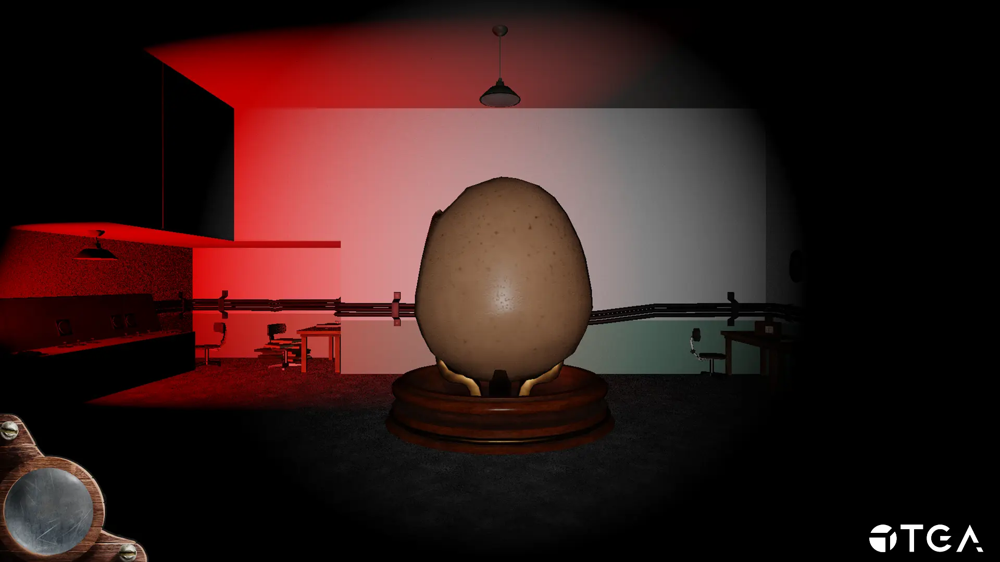

+++
title = 'Eggscapism'
tags = ['C++', 'Clockwork Engine', 'Direct3D 11', 'Perforce', 'YouTrack']
date = 2024-01-07T18:57:34+01:00
draft = false
screenshot = '/projects/the-game-assembly/eggscapism/egg.webp'
credits = [
    'Ameer Khalid',
    'Cecilia Ålander',
    'David Lindberg',
    'Ethan Uong',
    'Hedvig Kronnäs',
    'Ivar Sidorsson',
    'Jakob Pihl',
    'Jenny Hellström',
    'Jonathan Disenfeldt',
    'Linnéa Sjöstrand',
    'Luna Barane',
    'Olaus Klaveness',
    'Sofie Axelsson',
    'Siri Forsell',
    'Urban Gustavsson',
    'Viktor Pennonen',
    'Vincen Nguyen',
    'Youcef Lounes',
]
+++

Eggscapism is a narrative puzzler roughly 2 minutes in length. It was the fifth project 
at [The Game Assembly](https://thegameassembly.com) and it was the first project where 
we used our own game engine made from scratch. Given that I was the only programmer 
in my group willing to do graphics programming and that my graphics engine was the most 
complete at the time, we decided to use my engine as the foundation for our custom game 
engine.

I was responsible for
* Graphics programming
* Splash screens
* Main menu
* Pause menu
* Win menu
* HUD

Overall this project felt very chaotic. We had very many issues regarding our pipeline to iron out.
We never managed to find a correct way to convert a quaternion from Unreal Engine to 
euler angles. We still used meters as units compared to centimeters in Unreal Engine, which
made the models have very different scales and locations. The texture format we used for
normals and materials were incompatible and broke the normal/material mapping inside the engine.
Levels built in Unreal Engine did not look similar at all ingame because of the shading.

Isolating, fixing or hiding every issue was very difficult and time-consuming. I am suprised we were
the first to be approved.

