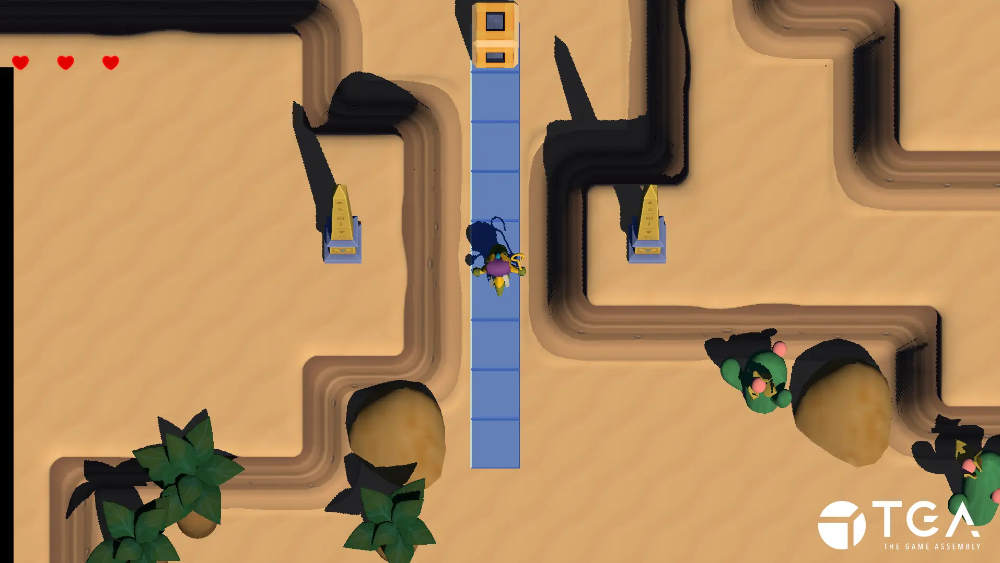
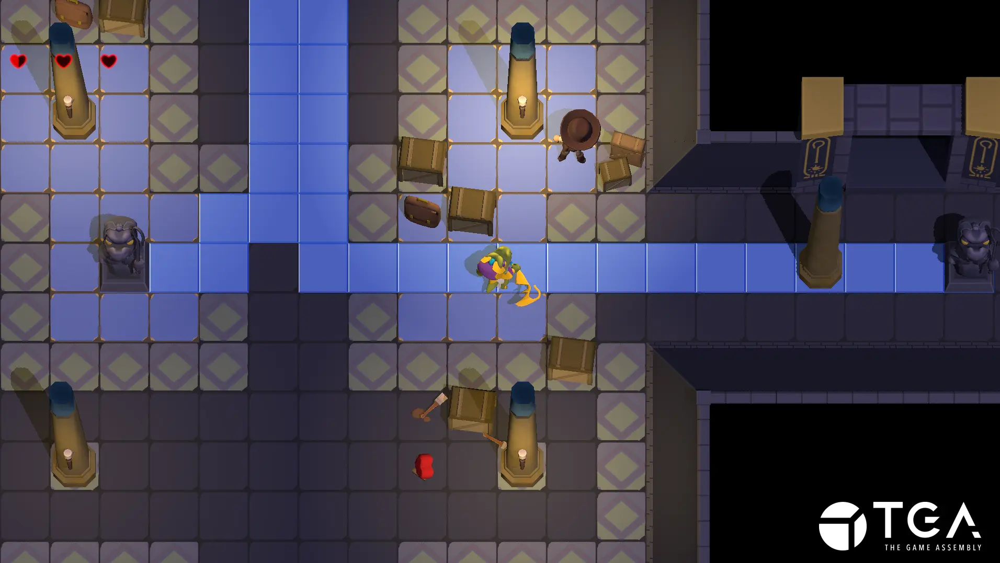
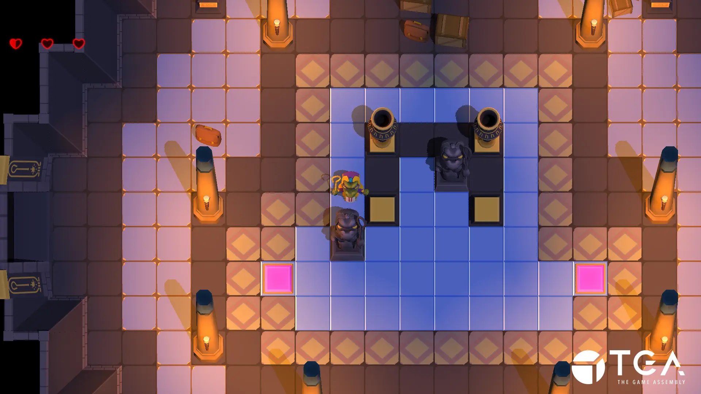
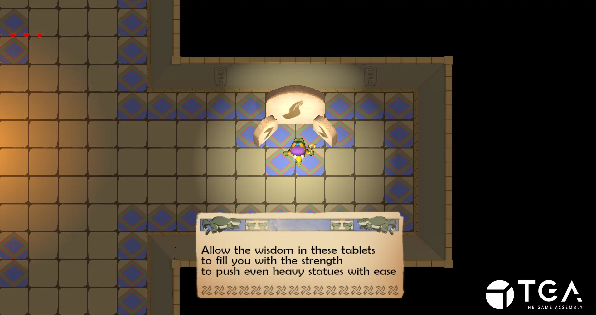

+++
title = 'When You See Me Cry'
tags = ['C++', 'The Game Engine', 'Perforce', 'Taiga']
date = 2024-01-07T18:57:32+01:00
draft = false
screenshot = '/projects/the-game-assembly/when-you-see-me-cry/puzzle1.webp'
credits = [
    'Alexander Ekengren',
    'Clara-Cecilia Ingner',
    'David Scholander',
    'Emil André',
    'Fredrik Christensen',
    'Ivar Sidorsson',
    'Joar Andersén',
    'Lukas Frej',
    'Måns Hedlund',
    'Omar Abdallah',
    'Ossian Sarén Gran',
    'Oliver Mathrani',
    'Thomas Holtz',
    'Viktor Pennonen',
    'Ylva Oknelid',
]
+++

_When You See Me Cry_ is a 3D adventure game heavily inspired by 
[The Legend of Zelda: A Link to the Past](https://en.wikipedia.org/wiki/The_Legend_of_Zelda:_A_Link_to_the_Past). 
It was my forth game project at [The Game Assembly](https://thegameassembly.com)
and was the last project made using The Game Engine.

I was responsible for
* Tile system
* Tile tools
* Debug drawing
* Collisions/intersections
* Entity movement respecting boundaries
* Rooms
* Doors
* Entity door lock conditions

Collisions and the tile system was were most of my time was spent in this project.
In the previous project Wolls, I created a tilemap which dramatically increased 
our performance for collision testing and rendering the level. 

I sought to create something similar in When You See Me Cry, and the tiles differed 
from those in Wolls in that they also had a list with every overlapping game object. 
This list was used to optimize collision checking and limit updates in the world to 
objects in the current room.

This worked, but not very well given the time investment in maintenance and the fact
that it wasn't a problem that had to be solved. It was a case of premature optimization
that I regret and I think a simpler solution would be to have a list of game objects per
room volume instead.

