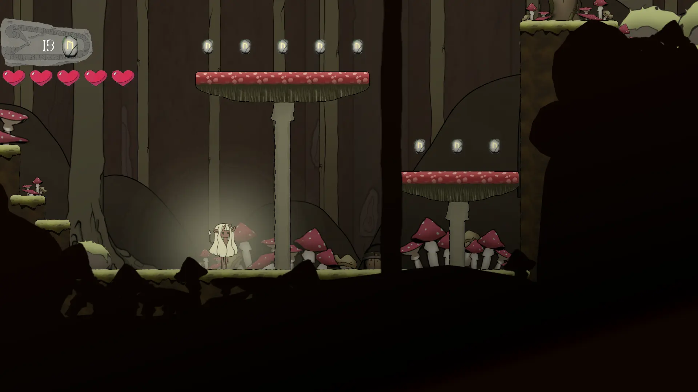
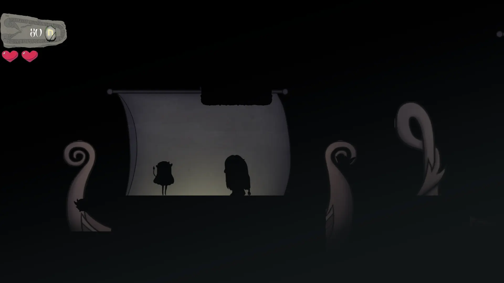
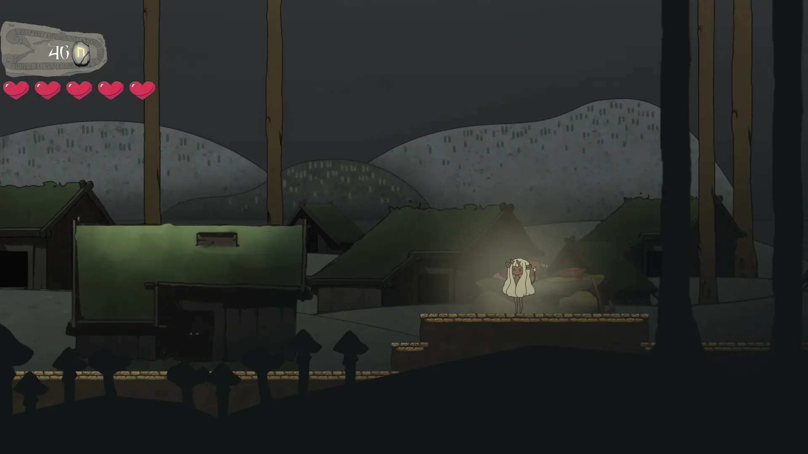

+++
title = 'Wolls'
summary = '''
_Wolls_ is a 2D platformer. It was our third game project and the first one made in 
The Game Engine, the internal game engine provided by [The Game Assembly](https://thegameassembly.com).
We used Unity as a level editor for our level designers and exported JSON-files which
we parsed in The Game Engine.
'''
tags = ['C++', 'The Game Engine', 'Perforce', 'Taiga']
date = 2024-01-07T18:57:30+01:00
draft = false
screenshot = '/projects/the-game-assembly/wolls/forest.webp'
credits = [
    'Elvira Aldén',
    'Fredrik Christensen',
    'Hanna Hinderson',
    'Ivar Sidorsson',
    'Jakob Persson',
    'Jesse Emmoth',
    'Luna Barane',
    'Måns Hedlund',
    'Nanna Lundin',
    'Philip Wolff',
    'Sandra Sandal',
    'Youcef Lounes',
]
+++



_Wolls_ is a 2D platformer. It was our third game project and the first one made in 
The Game Engine, the internal game engine provided by [The Game Assembly](https://thegameassembly.com).
We used Unity as a level editor for our level designers and exported JSON-files which
we parsed in The Game Engine.

I was responsible for
* Perforce
* Level
    * editor
    * parsing
    * management
    * playtest functionality
* Sprite sheet animation player
* Tilemaps
* Automatic DDS exporter
* Rendering optimizations
* Collisions/intersections
* Entity movement respecting boundaries
* Main menu
* Pause menu
* Settings menu
* Level selection menu
* Splash screens
* Loading screens
* Win screen
* Dialogue
* Vignette

I am particularly proud of the playtesting functionality and the automatic DDS exporter.

Since I already had intermediate C++ experience from Unreal Engine before I attended
The Game Assembly I hade a lot of time during the C++ course to research different
programming concepts I was unfamiliar with. Processes, subprocesses, environment variables
and the command line were all concepts I learned on my own and have found extensive
usage for. Both the playtesting functionality and the automatic DDS exporter used simple 
subprocesses to achieve their tasks. 

The playtest button simply generates the Visual Studio solution using premake, queries 
the path of the newest msbuild executable, builds the solution with a msbuild subprocess
and launches the freshly built executable as another detached subprocess. 

The automatic DDS exporter is similar in that the only programming necessary surrounds 
constructing the appropriate command line arguments. The DDS exporter only queries all 
Unity sprites, The Game Engine project content directory and launches the 
NVIDIA Texture Tool Exporter executable.

Both these tools were invaluable to the level designers and graphical artists. It allowed
them to playtest the game without worrying about becoming out of date with the latest bugfixes
and simplified the sprite pipeline substantially as graphical artists only had to update
sprites inside of Unity.

