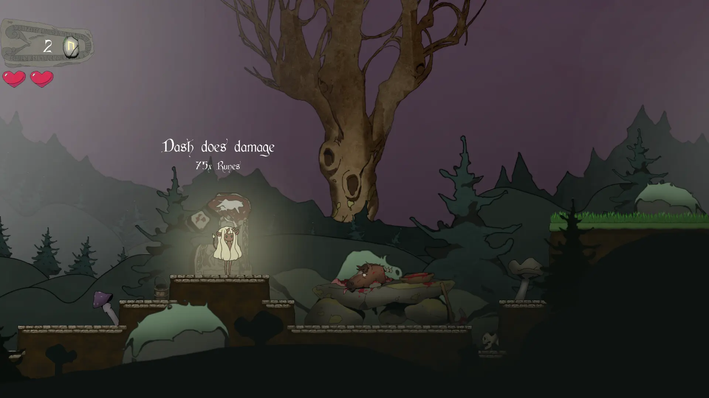

+++
title = 'Wolls'
date = 2024-01-07T18:57:30+01:00
draft = false
screenshot = '/projects/the-game-assembly/wolls/forest.webp'
+++

_Wolls_ is a 2D platformer. It was my third game project and our first made in The Game Engine, 
the internal game engine provided by [The Game Assembly](https://thegameassembly.com).

