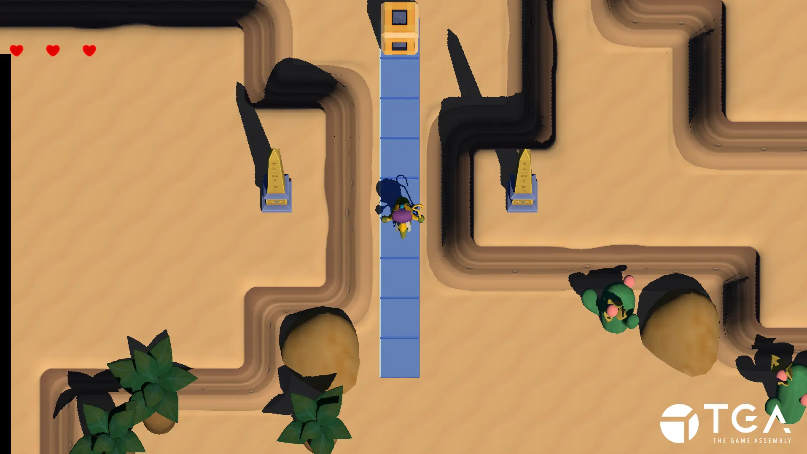
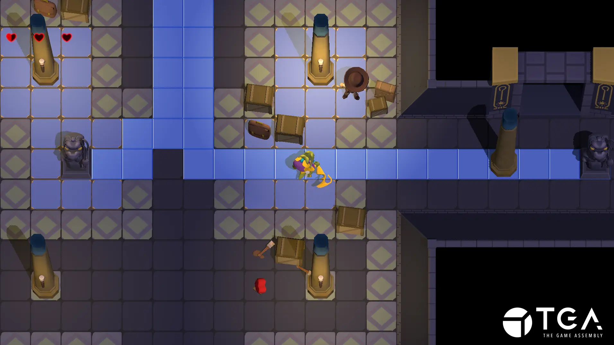
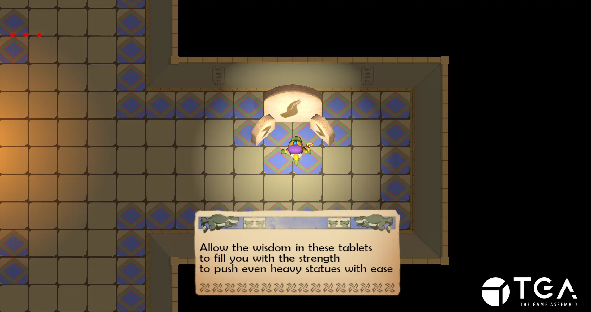

+++
title = 'When You See Me Cry'
date = 2024-01-07T18:57:32+01:00
draft = true
+++

_When You See Me Cry_ is a 3D adventure game heavily inspired by [The Legend of Zelda: A Link to the Past](https://en.wikipedia.org/wiki/The_Legend_of_Zelda:_A_Link_to_the_Past). It was my forth game project at [The Game Assembly](https://thegameassembly.com).

